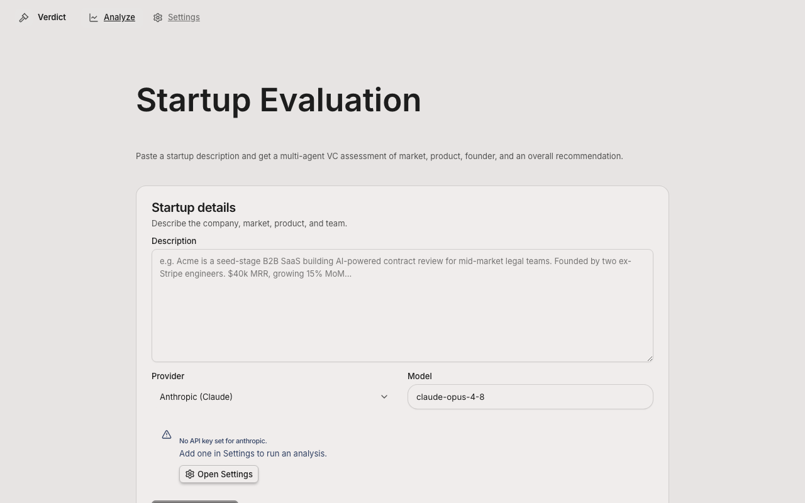
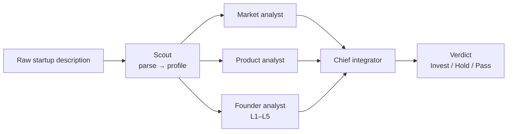

# Verdict — an AI VC Analyst

> Paste a startup description, get an investment **verdict** — Invest / Hold / Pass —
> from a team of specialist AI agents whose reasoning you can watch live,
> challenge, and re-run. Local-first and bring-your-own-key: your API key never
> leaves your machine.

Verdict is a small, honest take on the question *"can an LLM do a pre-seed VC's
first-pass screening?"* It runs a multi-agent pipeline (market · product ·
founder → chief integrator) over a company description and returns a structured,
explainable recommendation. It is built on a production-grade FastAPI + LangGraph
backend and a React/Vite desktop-style frontend.



---

## What it does

- **Multi-agent analysis.** A *scout* parses your raw text into a structured
  profile; three specialists — **Market**, **Product**, **Founder** — analyse it
  in parallel; a **Chief** integrator weighs them into a final verdict with
  confidence, key strengths, key risks, and a written rationale.
- **Founder segmentation (L1–L5).** The founder agent grades founder calibre on
  an explicit 5-level scale (inspired by SSFF) instead of a vague score.
- **Live progress.** Each agent streams its status (pending → running → done) and
  its result card appears the moment that agent finishes — no black-box spinner.
- **Refine & re-run.** Disagree with an agent? Add a correction or extra context
  to that specific agent and re-run the whole pipeline with your feedback injected.
- **Bring-your-own-key, local-first.** You paste your own Anthropic / OpenAI /
  DeepSeek key into the app. It is stored only in your browser and is **never**
  logged, persisted, or sent anywhere except directly to your chosen provider.

---

## Architecture



- **Backend** — FastAPI + LangGraph. The pipeline is a `StateGraph`
  (`scout → market ∥ product ∥ founder → chief`) compiled as a one-shot graph.
  Each node calls the LLM with structured output. Progress is emitted from inside
  nodes via LangGraph's custom stream writer and surfaced over an NDJSON
  streaming endpoint.
- **Frontend** — React + Vite + Tailwind (built on the Eigent shell). It consumes
  the stream with `fetch` + a `ReadableStream` reader and renders each agent card
  incrementally.
- **Data layer (optional)** — PostgreSQL + pgvector persists past analyses and
  feeds a long-term memory (via mem0 with a *local* embedder, so no extra API key
  is needed). The app runs fully without it; persistence just fails soft.

**Key endpoints** (`/api/v1/vc`): `POST /analyze`, `POST /analyze/stream`
(NDJSON), `GET /analyses`, `GET /health`. No auth — bring-your-own-key is the
only credential.

---

## Quickstart — download & run

### Prerequisites
- **Python 3.13+** and [`uv`](https://github.com/astral-sh/uv) (`pip install uv`)
- **Node.js 18+** and npm
- An API key from **Anthropic**, **OpenAI**, or **DeepSeek** (you provide it in
  the app)
- *(Optional)* Docker, only if you want analysis history + memory persistence

### 1. Clone
```bash
git clone https://github.com/JiweiFu/verdict-ai-vc-analyst.git
cd verdict-ai-vc-analyst
```

### 2. Install dependencies
```bash
# backend
cd backend && uv sync && cp .env.example .env && cd ..

# frontend
cd frontend && npm install && cd ..
```

### 3. Run (one command)
```bash
./start.sh
```
This boots the backend on `http://127.0.0.1:5001` and the frontend on
`http://localhost:5173`. Open the frontend URL in your browser. (`Ctrl+C` stops
both.)

### 4. Use it
1. Go to **Settings** → paste your API key for your provider → save.
2. Go to **Analyze** → paste a startup description → **Analyze**.
3. Watch the agents light up live; read the verdict.
4. Open a **Refine** box on any agent, add a correction, and hit **Rerun analysis**.

> **Try it from the terminal too:** `cd backend && ANTHROPIC_API_KEY=sk-... uv run python run_vc.py`
> runs the pipeline on a sample company and pretty-prints the result.

### (Optional) Enable history + memory
```bash
cd backend
docker compose up -d db      # Postgres + pgvector
uv run alembic upgrade head  # create tables
```

---

## Design notes — the thinking behind it

This section is the point of the project: not "an LLM wrapper", but a set of
deliberate engineering and product judgments.

**1. LLM-as-analyst, not ML black box — on purpose.**
Verdict's agent design is inspired by [SSFF](https://github.com/xisen-w/Startup-Success-Forecasting-Framework)
(Startup Success Forecasting Framework). SSFF pairs an LLM analyst pipeline with
classical ML (a random forest, a neural net for founder–idea fit, embeddings).
Studying it closely surfaced a through-line: **SSFF's "objectivity" quietly leans
on LLM subjective judgment everywhere** — the founder level, the categorical
feature labels, even the synthetic labels the ML is trained on are LLM-generated.
So for v1 I made a conscious cut: **keep the honest LLM-analyst pipeline, drop the
ML.** The random forest and embedding idea-fit added complexity and a veneer of
rigour without honest, validated signal at this stage. Better to ship something
transparent and then earn the ML back with real data and evaluation.

**2. Local-first, bring-your-own-key — a security stance, not a shortcut.**
A hosted site that asks a VC to paste their API key is a credential-exposure
risk. Verdict keeps the key in the user's browser and passes it straight to the
provider; the backend never logs or persists it (verified — there is no `api_key`
column and no key in logs). This is also what makes it safe to hand to a
non-technical partner: download, paste your own key, play.

**3. Human-in-the-loop by design.**
A verdict you can't interrogate is useless to an investor. Hence the live
per-agent streaming (you see *which* agent thinks *what*) and the per-agent refine
+ rerun loop (you can correct a wrong assumption and watch the verdict move).

**4. Production bones.**
It's built on a production template — async FastAPI, LangGraph state machine,
structured logging, Langfuse-ready observability, Alembic migrations, pgvector
memory — so the path from demo to product is about *adding the right things*, not
rewriting.

---

## Status & roadmap (honest)

This is a **working demo with production bones — not yet a production tool.**
Today the analysis reasons over the text you paste; it does not yet pull
real-world evidence, and its verdicts are not yet measured for accuracy. The
highest-leverage next steps, in order:

1. **Data grounding.** Enrich founders/companies from real sources (Companies
   House, GitHub, web search / RAG) so the analysis cites evidence instead of
   reasoning over a paragraph. *This is the single biggest gap.*
2. **Evaluation harness.** Backtest verdicts against known outcomes (e.g.
   VCBench) — the thing that earns the right to call it "VC-grade", and the
   honest place to add ML back.
3. **Calibration & citations.** Confidence that means something; sourced claims;
   anti-hallucination guards.

---

## Credits & license

Verdict stands on open-source shoulders — see [`NOTICE`](NOTICE) for full
attribution:
- **Backend template** — [wassim249/fastapi-langgraph-agent-production-ready-template](https://github.com/wassim249/fastapi-langgraph-agent-production-ready-template) (MIT)
- **Frontend shell** — [Eigent](https://github.com/eigent-ai/eigent) (Apache-2.0)
- **Research inspiration** — [SSFF](https://github.com/xisen-w/Startup-Success-Forecasting-Framework) (arXiv:2405.19456)

This project's own code is released under the [MIT License](LICENSE).
